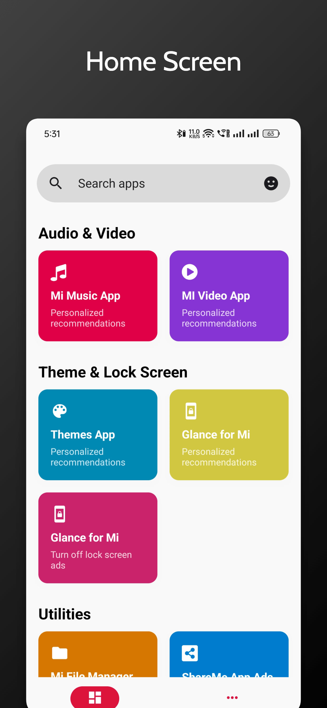
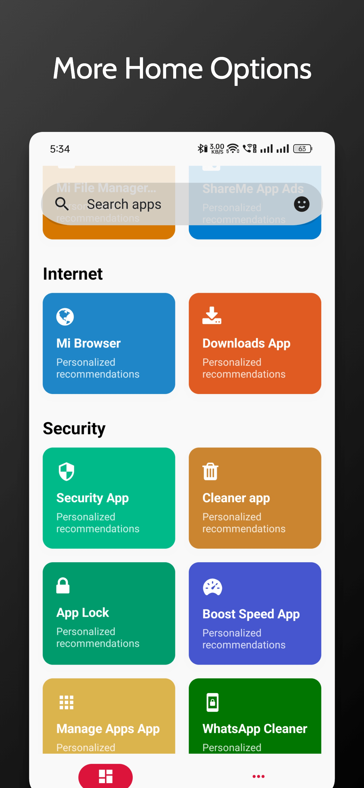
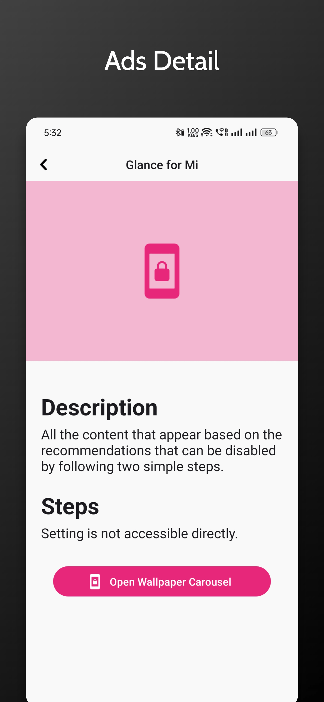
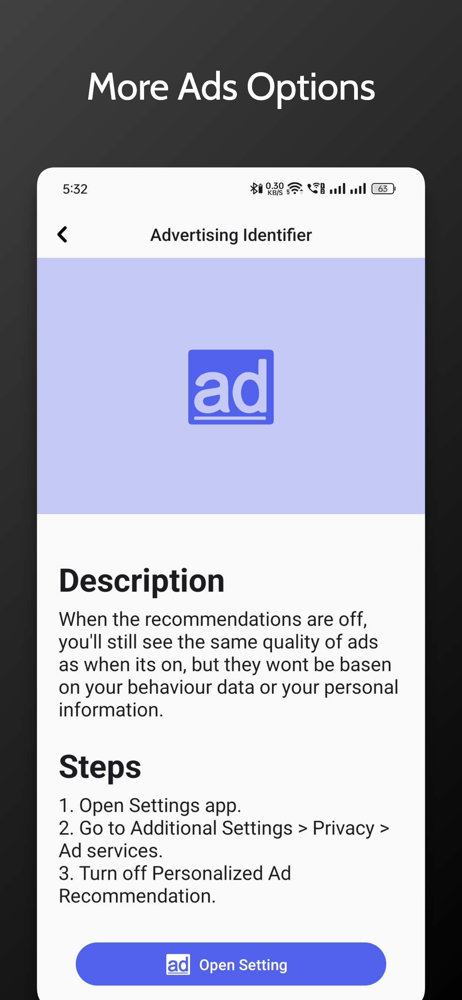
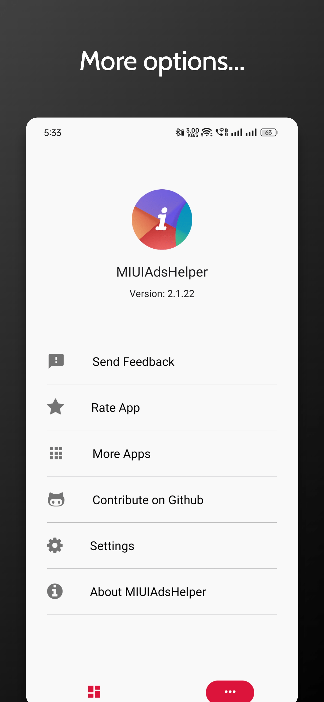
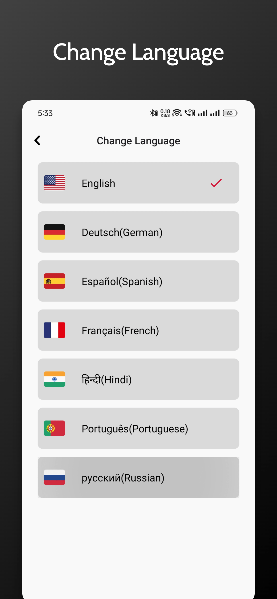
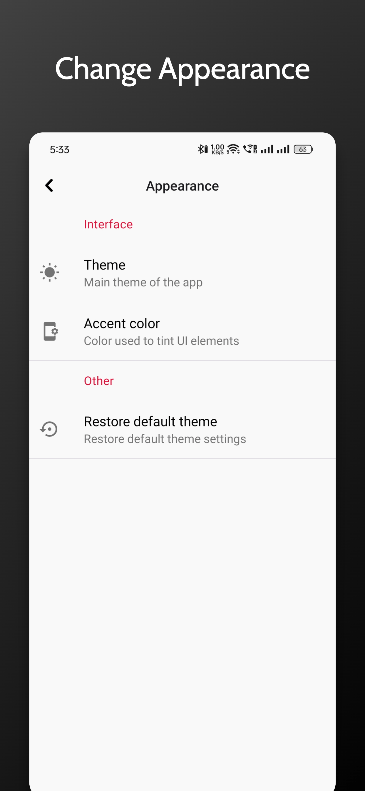
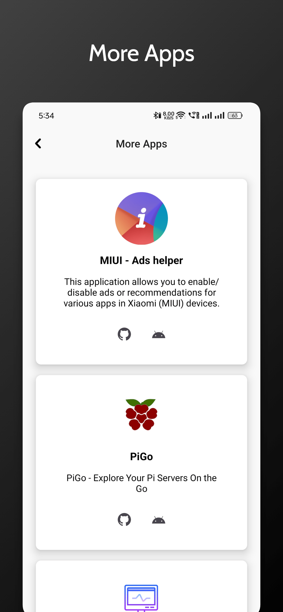
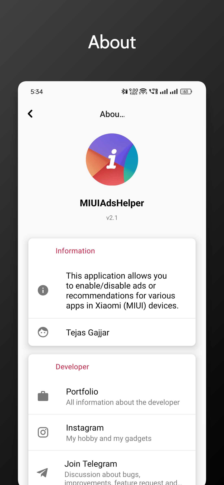

# Introduction

This application allows you to enable/disable ads or recommendations for various apps in Xiaomi (MIUI) devices with its simple and awesome card UI. There is a wide set of apps where you can able to enable or disable ads/recommendations. It's free and available to every Xiaomi's MIUI device.

## Installation

### Screenshots

|                                                 |                                                     |                                              |                                              |                                         |
| :---------------------------------------------: | :-------------------------------------------------: | :------------------------------------------: | :------------------------------------------: | :-------------------------------------: |
|  |  |  |  |  |

|                                                   |                                                         |                                               |                                              |                                          |
| :-----------------------------------------------: |:-------------------------------------------------------:| :-------------------------------------------: | :------------------------------------------: | :--------------------------------------: |
|  |  |  |  |  |

The application supports Android 6.0 (API 23) and above.

## Features include:

- Wide sets of MIUI apps supported. (MIUI 14, MIUI 13, MIUI 12 and MIUI 11 Supported.)
- Simple card UI and simple navigation.
- Supports easily navigating to ads or recommendations settings for some apps.
- Ads setting is easily reversible.
- Multi-language supported.
- Dark theme support.

## Building
>  Note: You can't Publish any Source code without permission.

### With Gradle

If you want to build from source, just do

    git clone https://github.com/gajjartejas/MIUIAdsHelper.git
    cd MIUIAdsHelper
    npm install or yarn
    ./gradlew build

### With Android Studio

1. Clone repo `git clone https://github.com/gajjartejas/MIUIAdsHelper.git`
2. In Android Studio select "Open an existing Android Studio Project"
3. Wait for Gradel to sync and then run or build.

## Contributing

There are many ways you can contribute to the development.

- Pull requests are always welcome!
- You must respect conventional commits for your commits and MR title.
- You can merge only if your CI is green.
- give priority to squash and merge, and not merge with a merge commit
- Please visit [CrowdIn](https://crowdin.com/project/miuiadshelper) in order to update and create new translations

## License

MIUIAdsHelper is licensed under the [GNU GENERAL PUBLIC LICENSE](https://github.com/gajjartejas/MIUIAdsHelper/blob/main/LICENSE).
